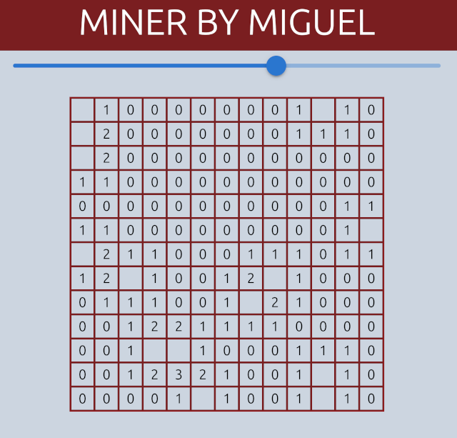

# 🟢 Buscaminas 

Este proyecto es una implementación del clásico juego de 
Buscaminas utilizando **React**, **Tailwind CSS**, 
y el enfoque **Feature-Sliced Design (FSD)**.

## 🌟  Características

- Interfaz modular y escalable.
- Manejo de estado con Context API.
- Diseño responsivo con Tailwind CSS.

---
## 🚀 Instalación

Asegúrate de tener **Node.js** instalado en tu sistema.

1. Clona este repositorio:
   ```bash
   git clone https://github.com/lindenson/buscaminas.git
   
2. Navega al directorio del proyecto:

    ```bash
    cd buscaminas
    ```

3. Instala las dependencias:

    ```bash
    npm install
    ```

## Ejecución
1. Inicia la aplicación en modo desarrollo:

   ```bash
    npm run build
    node server.cjs    
   ```
    
2. Abre tu navegador en http://localhost:8080 para jugar.

## Estructura del Proyecto
El proyecto sigue la arquitectura Feature-Sliced Design, con las siguientes capas principales:

```plaintext
src/
├── app/           # Configuración principal de la aplicación
├── entities/      # Objetos de dominio del proyecto
├── pages/         # Componentes de las páginas
├── processes/     # Lógica y procesos del juego
├── shared/        # Elementos comunes como estilos y utilidades
└── widgets/       # Componentes reutilizables como tablero y celdas

```
## Dependencias principales
- React<br/>
- Tailwind CSS

## Contribuciones
Haz un fork del repositorio.
Crea una rama para tus cambios: git checkout -b mi-rama.
Envía un pull request describiendo tus cambios.

## Licencia
Diseñado por Miguel de Tilo.
Este proyecto está licenciado bajo los términos de la MIT License.

## Pictures
